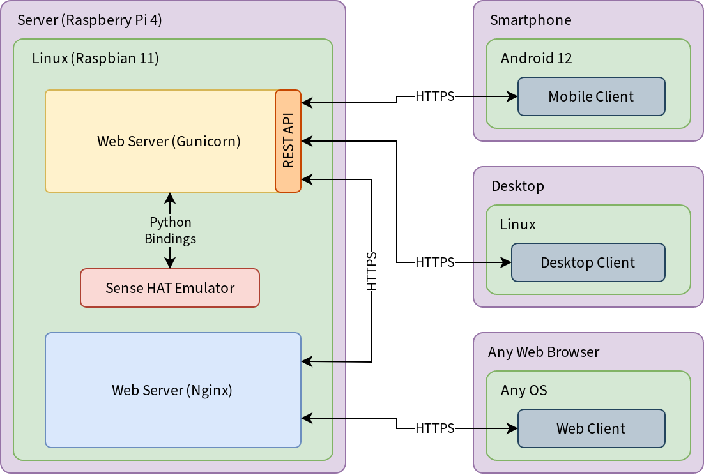
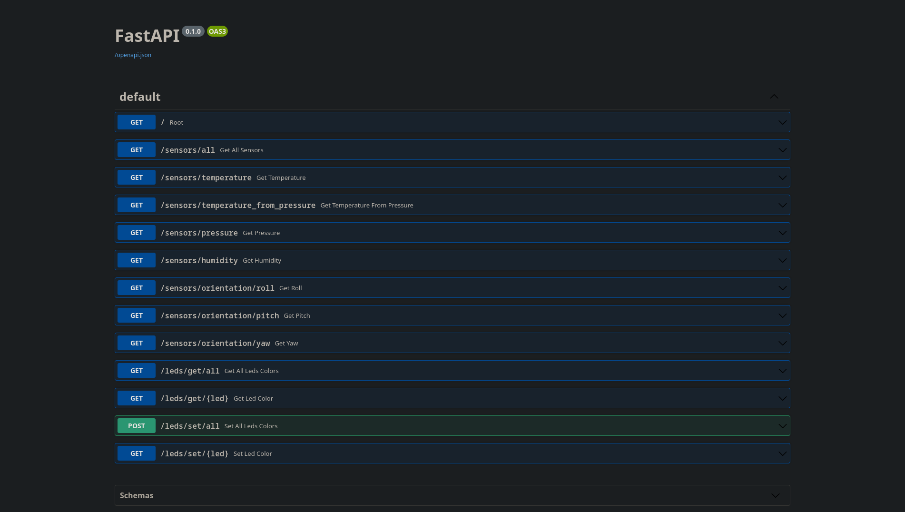
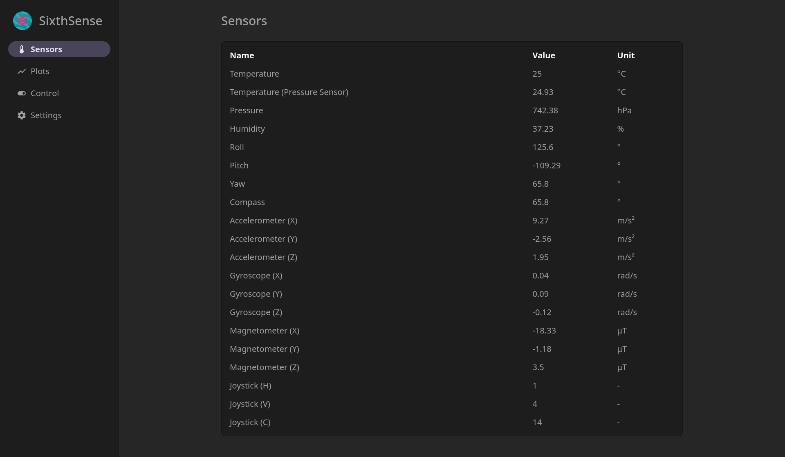
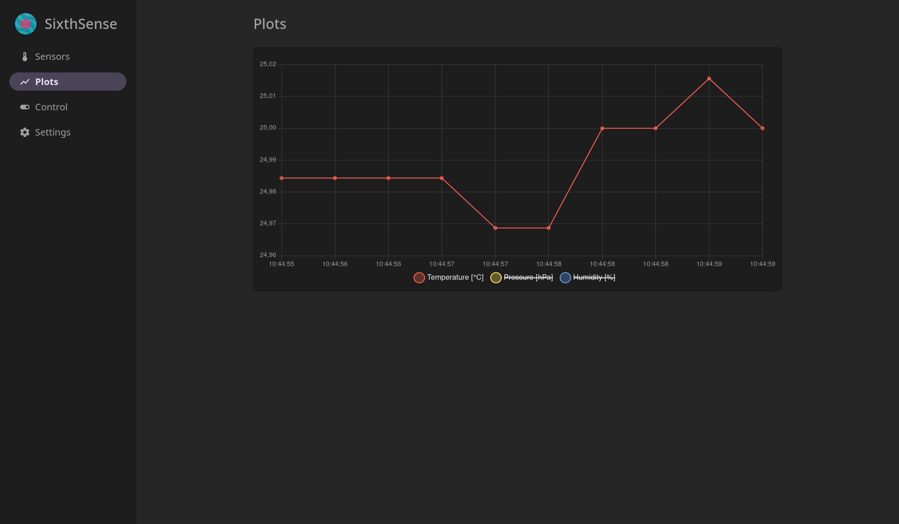
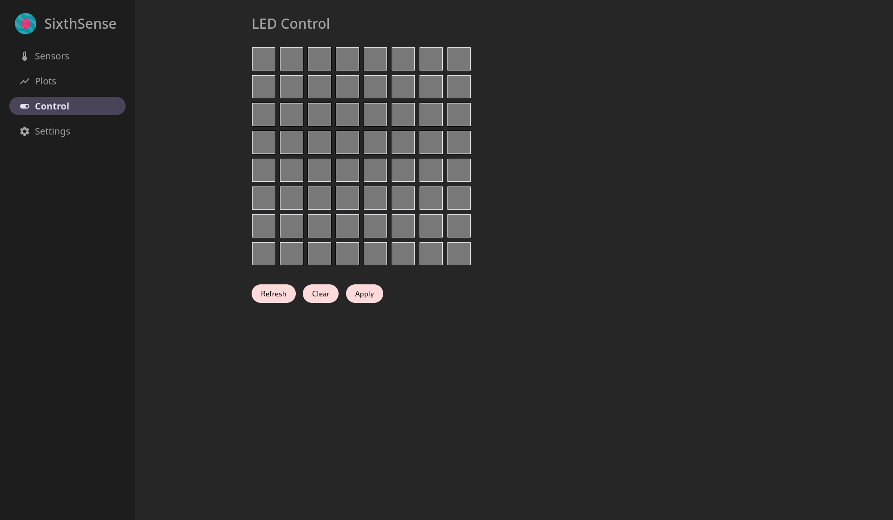
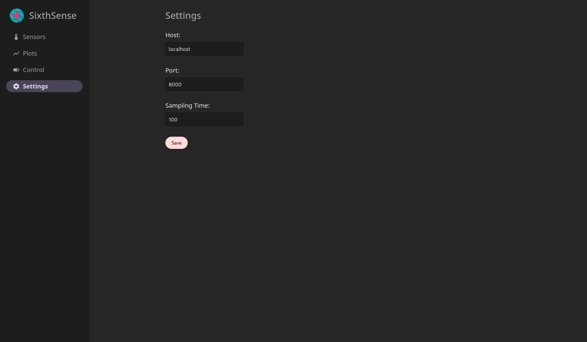

<h1 align="center">
  
   SixthSense  
</h1>

  <a href="https://github.com/ikajdan/sixthsense_server">Web Client</a> •
  <a href="https://github.com/ikajdan/sixthsense_mobile">Mobile Client</a> •
  <a href="https://github.com/ikajdan/sixthsense_desktop">Desktop Client</a>

The aim of this project was to create an IoT (Internet of Things) system composed of a SBC (Single Board Computer) with a Sense HAT attached. The server should host a REST (Representational State Transfer) API (Application Programming Interface) that enables clients to read and control peripherals of the hat.

Data from various sensors on the Sense HAT should be collected and exposed through the REST API. Real-time plots of the sensor data should be displayed on each client. The user should be able to control the LED matrix on the Sense HAT.

The architecture of the system can be seen in the diagram below.

 

  
    
  <em>System architecture.</em>

 

All the clients should expose a GUI (Graphical User Interface) to the user allowing for interaction with the embedded system. Three REST clients were developed:
- web-based client (this repository),
- [Android mobile client](https://github.com/ikajdan/sixthsense_mobile),
- [Linux desktop client](https://github.com/ikajdan/sixthsense_desktop).

The mobile app can be run on any Android 12 or newer operating system. The desktop program can be run on any Linux-based operating system. The web-based client is platform agnostic, therefore can be accessed through any modern web browser.

Due to a high price and low availability of the Sense HAT, a software emulator was used, which provides Python bindings identical to the physical device.

## Server

The REST API server is implemented using the FastAPI Python library. The server exposes endpoints as shown in the diagram below. Each endpoint is responsible for a different aspect of the system. The `/sensors` endpoint is used to read the sensor data. The `/leds` endpoint is used to control the LED matrix.

 

  
    
  <em>Architecture of the system.</em>

 

## Web Client

The web client is a multi-page application built with HTML, CSS, and JavaScript. It is responsible for displaying the sensor data and controlling the LED matrix. The client is platform agnostic and can be accessed through any modern web browser.

 

  
&nbsp; &nbsp; &nbsp; &nbsp;
  
    
  <em>Sensors (left) and plots (right) pages.</em>

 

 

  
&nbsp; &nbsp; &nbsp; &nbsp;
  
    
  <em>LED control (left) and settings (right) pages.</em>

 

## License

This project is licensed under the MIT License. See the [LICENSE](LICENSE.md) file for details.
